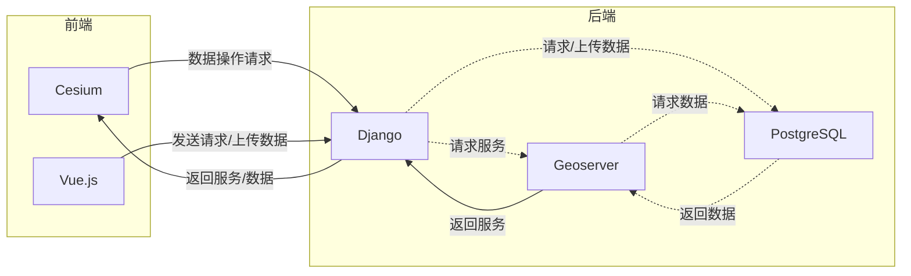

## 项目背景
处理地理信息的最终环节是发布。但大多数桌面 GIS 应用只提供了导出到本地文件的形式，不利于分享和传播。我们认为这是一个真实存在的需求，因此我们的项目将在支持在线可视化地理信息的基础上注重快速、可嵌入页面的地图服务发布。
## 项目描述
### 概述
*MapEver*是一个完全在线的GIS系统，用户可用其来收集、组织、管理、分析和可视化地理信息。*MapEver*可在任何地点通过桌面端 web 浏览器使用，快速发布地理信息以供所有人访问。
### 功能
 > 暂定
 - 用户可以上传地理信息数据，或访问在线资源库以获取公开数据，或提供URL以访问位于其他服务器上的数据。
 - 用户可以组织、管理所有拥有访问权限的地理信息数据，也可以指定格式导出到本地。
 - 用户可以对自行上传或从服务器获取的数据进行在线的处理、分析、查看。
 - 用户可以发布地图数据，以URL的形式分享或嵌入到自己创建的网页应用中
#### 数据可视化
 - [ ] 矢量数据符号化，指定或基于数据表的大小、颜色、方向、粗细、填充、支持自定义的符号
 - [ ] 矢量数据标注，文本格式、描边、掩膜、位置、背景
 - [ ] 矢量数据属性表可视化
 - [ ] 矢量数据3D可视化，自定义高程字段
 - [ ] 栅格数据符号化，波段选择、图像增强、颜色渲染、透明度
#### 数据存储
 - [ ] 允许上传.zip、.tar、.gz、.shp、.json、.geojson、.gpkg、.gdb、.mdb、.hdr、.tif、.img 文件
 - [ ] 支持数据条件排序、条件查找
#### 数据格式转换/导出
 - [ ] 支持矢量数据之间、栅格数据之间互相转换
 - [ ] 支持文件下载到本地
#### 数据发布
 - [ ] 支持完成可视化的地图在单独页面中打开，以 URL 的形式发布
 - [ ] 支持视图创建为 html 格式以 iframe 形式插入到其他页面中，视图支持正常的缩放操作
#### 矢量数据处理
 - [ ] 要素修改、绘制要素、删除要素、创建空矢量数据
 - [ ] 叠加分析，相交、裁剪、融合、联合、交集取反
 - [ ] 几何分析，提取中心点、面线点互转、提取顶点
 - [ ] 重投影
#### 栅格数据处理
 - [ ] 配准
 - [ ] 裁剪
 - [ ] 栅格计算器
 - [ ] 重投影
 - [ ] 重采样
### 架构

## 开发环境
### 浏览器支持
Chrome 88+ / Edge 88+ / Firefox 85+
> 分别是第一个完全不支持 flash player 的版本，助力 flash 死亡，从我做起

## Build Setup

``` bash
# 安装 yarn
> yarn 使用多进程，比 npm 更为高效
npm install -g yarn

# 安装依赖
yarn install

# 启动和热重载
yarn serve

# 快速格式化
yarn lint
```

For a detailed explanation on how things work, check out the [guide](http://vuejs-templates.github.io/webpack/) and [docs for vue-loader](http://vuejs.github.io/vue-loader).
